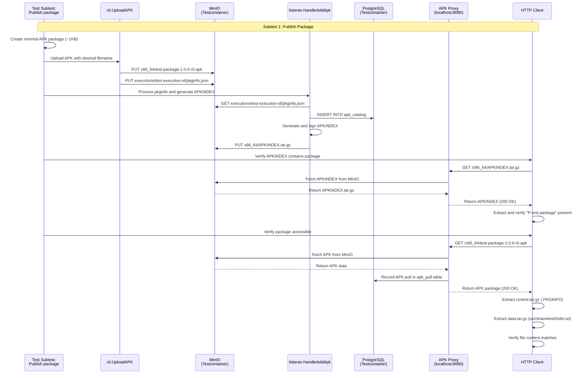
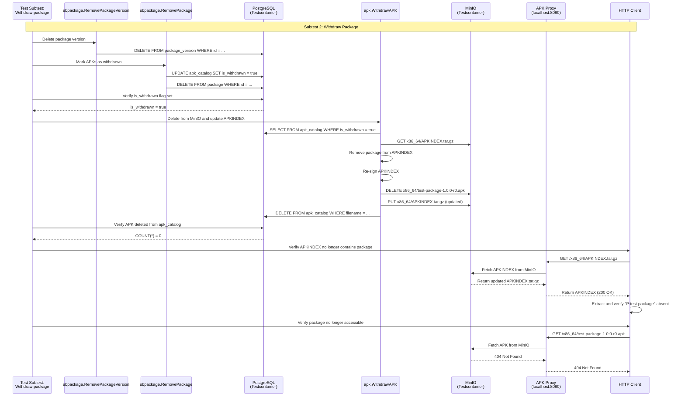

# APK Proxy Integration Tests

## Overview

This directory contains integration tests for the APK proxy service. The tests validate the complete workflow of uploading and retrieving Alpine APK packages through the proxy.

## Test Architecture

The test suite (`TestAPKProxyHappyPath`) validates the complete package lifecycle with two subtests:

1. **"Publish package"** - Uploads and publishes an APK package
2. **"Withdraw package"** - Removes the package from the repository

### Publish Package Flow

### Withdraw Package Flow

## Test Coverage

### TestAPKProxyHappyPath

**Subtest: "Publish package"**
- ✅ Create minimal APK package (~1KB with test file)
- ✅ Upload APK using production `cli.UploadAPK`
- ✅ Generate pkginfo JSON in executions folder
- ✅ Process pkginfo using `listener.HandleAddApk`
- ✅ Generate and sign APKINDEX
- ✅ Verify APKINDEX contains package entry
- ✅ Retrieve APK package through proxy (200 OK)
- ✅ Extract and validate APK control.tar.gz (.PKGINFO)
- ✅ Extract and validate APK data.tar.gz (usr/share/test/hello.txt)
- ✅ Verify file content matches expected value

**Subtest: "Withdraw package"**
- ✅ Delete package version using `sbpackage.RemovePackageVersion`
- ✅ Mark APKs as withdrawn using `sbpackage.RemovePackage`
- ✅ Verify `is_withdrawn` flag set in database
- ✅ Delete from MinIO using `apk.WithdrawAPK`
- ✅ Update APKINDEX (remove package entry)
- ✅ Verify package deleted from `apk_catalog`
- ✅ Verify APKINDEX no longer contains package entry
- ✅ Verify package returns 404 through proxy

