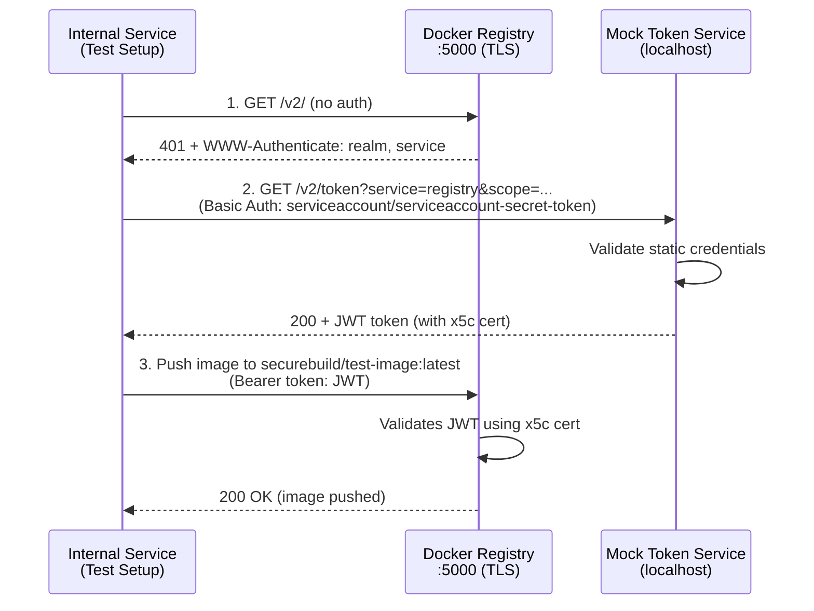
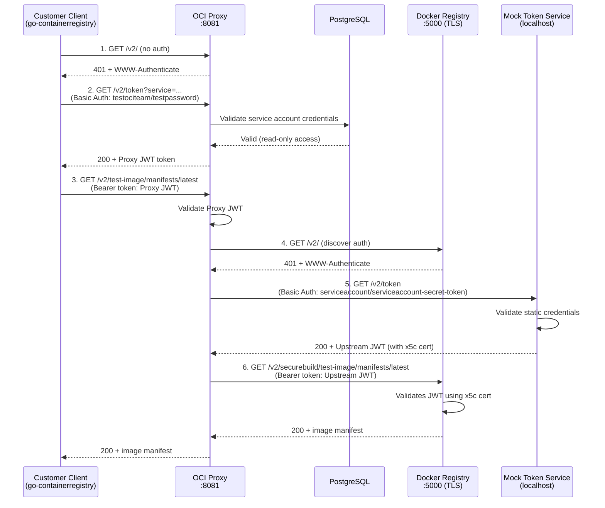

# OCI Proxy Integration Tests

This directory contains integration tests for the OCI Proxy service, which acts as an authenticated proxy between clients and an upstream Docker registry.

## Architecture

### Phase 1: Push Image (Internal Service)

The internal service uses static credentials to push images directly to the upstream registry.



### Phase 2: Pull Image (Customer Client)

Customers use their team's read-only service account to pull images through the OCI Proxy.



## Service Interactions

### Phase 1: Push Image (Internal Service)

The internal service (test setup code) acts as the "client" to populate the upstream registry:

1. **Internal Service → Registry**: Initial request returns 401 with auth challenge
2. **Internal Service → Token Service**: Exchange static credentials (`serviceaccount`/`serviceaccount-secret-token`) for JWT token using `transport.Exchange()`
   - Token service validates credentials
3. **Internal Service → Registry**: Push image to `securebuild/test-image:latest` using JWT token
   - Registry validates JWT using x5c certificate

### Phase 2: Pull Image (Customer Client)

Customer clients use their team's read-only service account to pull images:

1. **Customer Client → OCI Proxy**: Request image without auth
2. **Customer Client → OCI Proxy**: Authenticate using service account credentials (`testociteam`/`testpassword` from seed data)
   - OCI Proxy validates credentials against PostgreSQL database
   - OCI Proxy returns its own JWT token
3. **Customer Client → OCI Proxy**: Request image with Proxy JWT token
4. **OCI Proxy → Registry**: Use `transport.Ping()` to discover auth realm
5. **OCI Proxy → Token Service**: Use `transport.Exchange()` to exchange static credentials for upstream JWT
   - Token service validates static credentials
6. **OCI Proxy → Registry**: Forward request with upstream JWT token (translates path from `test-image` to `securebuild/test-image`)
   - Registry validates JWT using x5c certificate
7. **Registry → OCI Proxy → Customer**: Return image data

## Key Differences

- **Phase 1 (Internal Service)**: Uses static credentials (`serviceaccount`/`serviceaccount-secret-token`) to push images directly to upstream registry at `securebuild/` path
- **Phase 2 (Customer Client)**: Uses team service account credentials (`testociteam`/`testpassword`) to pull images through OCI Proxy, which transparently handles upstream authentication and path translation

## Test Files

- `proxy_test.go` - Main integration test
- `db.go` - PostgreSQL database setup and SchemaHero migrations
- `registry.go` - Docker registry and mock token service setup
- `proxy.go` - OCI Proxy server setup and test image creation

## Running Tests

```bash
go test -v ./integration/ociproxy/
```
