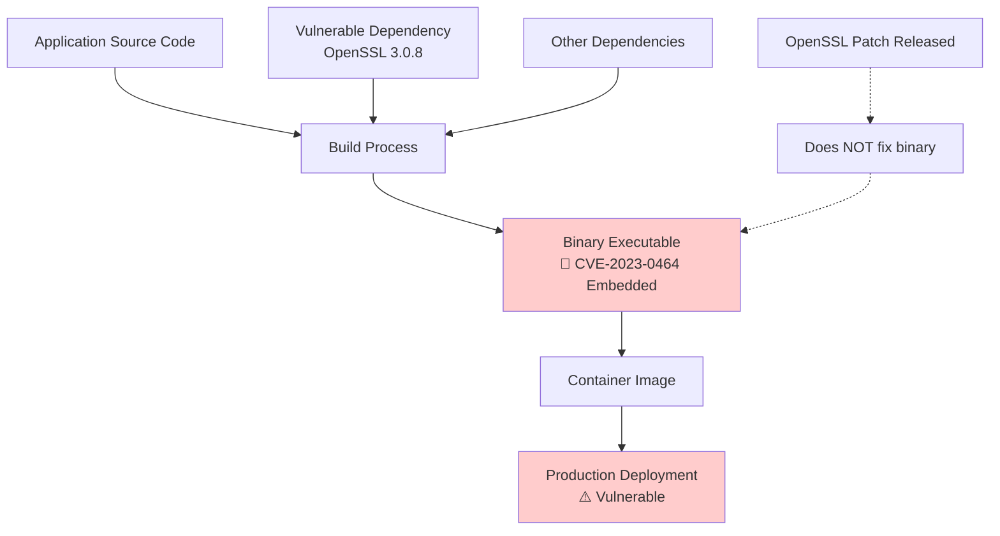
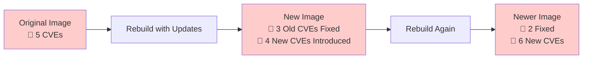
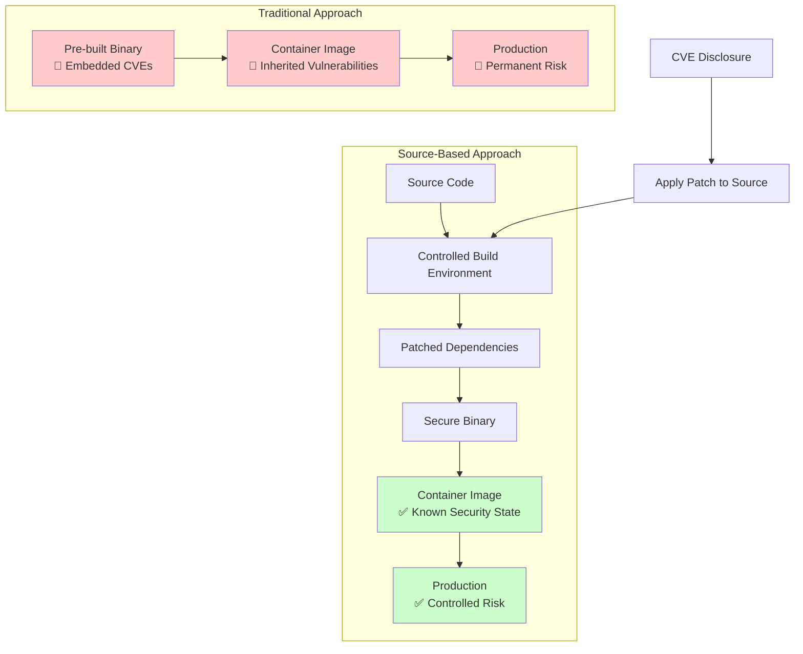
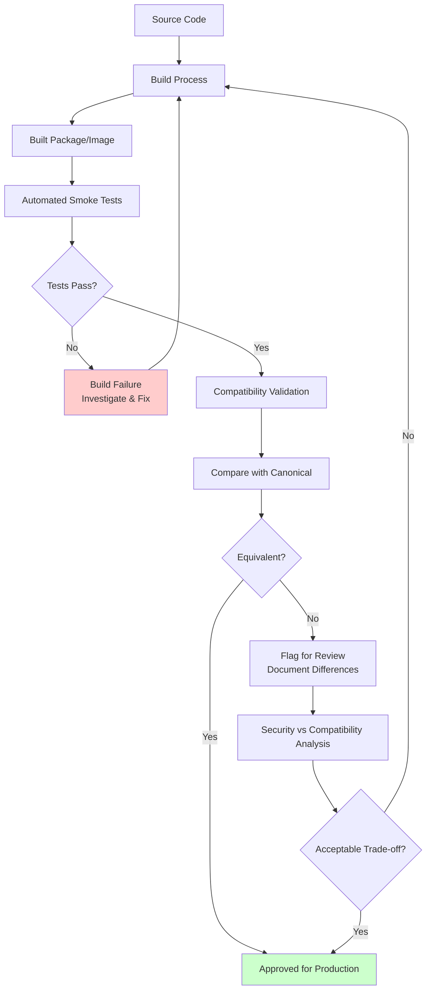

# Building from Source: The Only Viable Solution to Container Vulnerability Management

The software supply chain crisis has reached a critical point. 
Despite billions invested in vulnerability scanning and patch management, 
containerized applications remain fundamentally vulnerable to supply chain attacks and embedded security flaws.

This document examines why traditional approaches to container security are insufficient 
and demonstrates that rebuilding software from source code represents the only comprehensive solution to the problem.

## The Fundamental Problem: Embedded Vulnerabilities

### How Vulnerabilities Become Permanent

When developers release software binaries—whether through GitHub releases, package managers, or container registries—
they inadvertently embed the vulnerabilities present in their dependencies at compile time.

This creates a permanent security debt that cannot be resolved without rebuilding from source.

Consider a typical scenario: A popular web server binary released six months ago was compiled against OpenSSL 3.0.8, 
which contained CVE-2023-0464. Even if OpenSSL releases a patch tomorrow, 
that web server binary will forever contain the vulnerable code.

The vulnerability isn't just linked—it's literally compiled into the executable.

### The Scale of the Problem

Modern applications don't just have a few dependencies—they have dependency trees thousands of nodes deep. 
A typical Node.js application pulls in over 1,000 transitive dependencies. 
A Go binary might embed 200+ libraries.

Each dependency represents a potential vulnerability surface that becomes permanently embedded in the final binary.

**Real-world example:** The popular Docker image `nginx:1.20` contains over 150 packages. 
When CVE-2022-3715 was discovered in bash (a transitive dependency), 
every single nginx container image built with that version of bash remained vulnerable 
until the image was completely rebuilt—not just "patched."

## Why Traditional Security Approaches Fall Short

### 1. Vulnerability Scanning: Too Little, Too Late

Vulnerability scanners can identify what CVEs exist in your containers, but they cannot fix them. 
They're essentially sophisticated inventory tools that tell you how vulnerable you are, 
not how to become secure.

Vulnerability scanning is reactive.

**The Scanning Paradox:**

- Scanners detect CVE-2023-1234 in your production container
- The vulnerability is embedded in a compiled binary
- No amount of scanning changes the fact that the vulnerable code is permanently present
- Your only option is to wait for an upstream rebuild and hope they don't introduce new vulnerabilities

### 2. Runtime Patching: Impossible for Compiled Languages

Runtime patching works for interpreted languages 
but is fundamentally impossible for compiled binaries.

You cannot patch a Go binary or a C executable without recompiling from source.

### 3. Image Rebuilding: Playing Vulnerability Whack-a-Mole

Rebuilding container images with "updated" base images often introduces new vulnerabilities 
while fixing old ones.

This approach treats symptoms rather than the disease.

### 4. The Trust Problem

When you use pre-built binaries, you're trusting:

- The upstream maintainer's build environment
- Their dependency management practices
- Their security update cadence
- Their build toolchain security
- Every contributor to every dependency

This trust model is fundamentally broken at scale.

## The Source-Based Solution

### Complete Control Through Source Compilation

Building from source provides complete control over the security posture of your applications.

Instead of inheriting vulnerabilities from unknown build environments, 
you control every aspect of the compilation process.

**The Source-Based Advantage:**

1. **Immediate Vulnerability Resolution** - When a CVE is disclosed, 
   apply the patch and rebuild
2. **Controlled Dependencies** - Choose exactly which versions of dependencies 
   to include
3. **Security Hardening** - Apply compile-time security hardening 
   that's impossible with pre-built binaries
4. **Audit Trail** - Complete visibility into what code is included 
   and why

### Breaking the Vulnerability Inheritance Cycle

## The Economics of Source-Based Security

### Cost of Vulnerability Management

**Traditional Approach Costs:**

- Continuous vulnerability scanning infrastructure
- Security team time triaging false positives
- DevOps time rebuilding images with new vulnerabilities
- Business risk from unpatched vulnerabilities
- Compliance overhead proving security posture

**Source-Based Approach Benefits:**

- Proactive security instead of reactive patching
- Reduced vulnerability scan noise (fewer false positives)
- Faster time-to-patch (no waiting for upstream maintainers)
- Stronger compliance posture with complete audit trails
- Reduced business risk from supply chain attacks

### Return on Investment

Organizations implementing source-based builds typically see:

- **60-80% reduction** in security-related incidents
- **50% faster** time-to-patch for critical vulnerabilities
- **90% reduction** in vulnerability scanner false positives
- **Significant improvement** in compliance audit outcomes

## Implementation Considerations

### Multi-Architecture Native Compilation

Building from source enables true native compilation for each target architecture, 
avoiding the performance penalties and compatibility issues of cross-compilation or emulation.

### Reproducible Builds

Source-based builds can be made completely reproducible—the same source code produces bit-for-bit identical binaries. 
This enables:

- Verification of build integrity
- Compliance with regulatory requirements
- Simplified dependency management
- Enhanced supply chain security

### Automated Security Hardening

Compile-time security hardening can be applied consistently across all builds:

- Stack protection mechanisms
- Control flow integrity
- Memory safety enhancements
- Architecture-specific optimizations

## Ensuring Functional Equivalence Through Testing

### The Testing Challenge in Source-Based Builds

When building software from source, maintaining functional equivalence with canonical binaries is critical.

Organizations need confidence that their security improvements don't introduce compatibility issues 
or behavioral changes that could impact production systems.

### Automated Package Validation

SecureBuild implements comprehensive automated testing for every package built from source:

**Smoke Testing Pipeline:**

- **Functional Verification** - Each package undergoes automated smoke tests 
  to verify core functionality
- **API Compatibility** - Critical interfaces and APIs are tested 
  to ensure compatibility with downstream consumers
- **Performance Validation** - Basic performance characteristics 
  are verified to match expected baselines
- **Integration Testing** - Packages are tested in common usage scenarios 
  to identify potential issues

### Container Image Compatibility Validation

Beyond package-level testing, every container image built from source 
undergoes rigorous compatibility validation:

**Canonical Equivalence Testing:**

- **Entrypoint Validation** - Verify the image starts 
  with identical entrypoint behavior
- **Command Compatibility** - Ensure all expected commands and utilities 
  function correctly
- **Environment Consistency** - Validate that environment variables and system state 
  match canonical images
- **Port and Volume Configuration** - Confirm network and storage configurations 
  work as expected

### Testing Strategy Benefits

**Risk Mitigation:**

- Catch compatibility issues before production deployment
- Identify when security hardening affects functionality
- Provide confidence in source-built alternatives

**Quality Assurance:**

- Systematic validation of every build
- Reproducible testing processes
- Clear documentation of any behavioral differences

**Operational Confidence:**

- Teams can trust source-built images as drop-in replacements
- Reduced fear of breaking changes when improving security
- Clear audit trail of testing and validation

### Handling Test Failures and Differences

When tests reveal differences between source-built and canonical images:

1. **Security-Positive Differences** - Document and approve 
   (e.g., additional hardening)
2. **Functional Regressions** - Investigation and remediation 
   required
3. **Performance Variations** - Analysis to determine 
   if acceptable trade-off
4. **Behavioral Changes** - Careful review 
   to ensure compatibility

This testing framework ensures that the security benefits of source-based building 
don't come at the cost of reliability or compatibility.

## Beyond Vulnerability Management

### Complete Software Bill of Materials (SBOM)

Source-based builds enable generation of comprehensive SBOMs that include:

- Exact source code commits used
- All build-time dependencies
- Applied patches and modifications
- Build environment details
- Cryptographic signatures and attestations

### Supply Chain Transparency

Every component in your software supply chain 
becomes transparent and auditable:

- No mystery binaries from unknown sources
- Complete provenance tracking
- Verifiable build processes
- Cryptographic attestation of build integrity

## Conclusion: The Path Forward

The vulnerability crisis in containerized applications 
cannot be solved by better scanning or faster patching.

It requires a fundamental shift from trusting unknown binaries 
to controlling the entire build process from source code.

Organizations that continue to rely on pre-built binaries 
will remain perpetually vulnerable to embedded security flaws, 
supply chain attacks, and the whims of upstream maintainers.

Those that adopt source-based building 
gain complete control over their security posture 
and can respond to threats in hours rather than months.

The question isn't whether to build from source—
it's how quickly you can make the transition 
before the next major supply chain attack affects your organization.

**Ready to take control of your container security?** 
Learn about [our tooling](/our-tooling) and see how SecureBuild makes 
source-based container building practical at scale.
