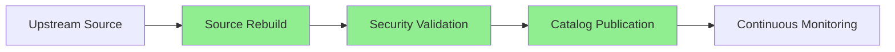

# Image Catalog: Secure Builds for Open Source Projects

SecureBuild's Image Catalog provides access to professionally rebuilt container images from our partner ecosystem. Every image is built from source with the latest security patches, ensuring you can deploy popular open source projects without known CVEs.

## Browsing the Catalog

The catalog experience depends on your access level:

### Unauthenticated View
Without signing in, you can explore our **Popular Secure Builds** - a curated selection of our most popular partner projects displayed in a carousel format. This gives you a preview of what's available and shows real-time vulnerability metrics for each project.

### Full Catalog (Sign In Required)
After signing in, you'll access the complete **SecureBuild Catalog** with all partner projects displayed in a searchable grid. Each project card shows:

- **Project Name & Logo**: Clear identification of the open source project
- **Partner Badge**: Green "✓ Partner" indicator for official partner projects
- **Vulnerability Count**: Red badge showing how many vulnerabilities were fixed (e.g., "4 vulnerabilities fixed", "165 vulnerabilities fixed")
- **Category Tag**: Project classification (Database, Kubernetes, Software Delivery, Auth, etc.)
- **Description**: Brief overview of what the project does
- **View Details Button**: Access full project information, available images, and download options

## What's in the Catalog

Our catalog features secure builds of popular open source projects across multiple categories:

- **Databases**
- **Kubernetes Tools**
- **Software Delivery**
- **Authentication**
- **Cloud Storage**
- **Development**
- **And many more partner projects...**

Each project undergoes our comprehensive rebuild process:

## Understanding Vulnerability Counts

The vulnerability count displayed on each project card (e.g., "4 vulnerabilities fixed", "165 vulnerabilities fixed") represents the number of known CVEs that SecureBuild has eliminated through our rebuild process. This count reflects:

- **Proactive Security**: We identify and patch vulnerabilities before they reach your infrastructure
- **Transparency**: You can see exactly how many security issues we've addressed
- **Continuous Monitoring**: These counts update as new vulnerabilities are discovered and fixed

A **"0 vulnerabilities fixed"** badge doesn't mean the project has never had vulnerabilities - it means the current upstream version has zero known CVEs that need patching.
When the SecureBuild verion is rebuilt, it is automatically compared to the upstream version.

## Accessing Images

### Browse Without Sign In
Anyone can explore the popular Secure Builds to see what's available and review vulnerability metrics.

### Full Catalog Access
Sign in to view the complete catalog of all partner projects, with detailed information and filtering capabilities.

### Download Requirements
**Active subscription required for image downloads.** While our catalog is publicly browsable, downloading and deploying CVE-free images requires an active SecureBuild subscription to the specific project you want to use.

## How Images Are Maintained

### Continuous Security Monitoring

Every image in our catalog is continuously monitored for:

- **New CVE Disclosures**: Automatic detection of new vulnerabilities
- **Dependency Updates**: Tracking upstream dependency releases
- **Source Code Changes**: Monitoring for security-relevant commits
- **Build Failures**: Ensuring rebuild processes remain functional

### Automatic Rebuilds

When security issues are detected:

1. **Immediate Assessment**: CVE severity and impact analysis
2. **Dependency Update**: Patch vulnerable dependencies
3. **Source Rebuild**: Complete rebuild from updated source
4. **Quality Validation**: Automated and manual testing
5. **Catalog Update**: New image published within 6 days for critical CVEs

### Version Management

Image tags may vary and generally follow upstream conventions. In all cases, the available tags are viewable on the image Tags screen. For example, see the [SchemaHero tags](https://securebuild.com/images/schemahero/inspect/tags) to view all available versions.

- **Upstream Compatibility**: Tags typically match upstream project conventions
- **Multiple Tag Schemes**: May include semantic versions, latest, and date-based tags

## Partner Projects

Many images in our catalog are created in partnership with open source project maintainers, ensuring enterprise-grade security with direct upstream support. Learn more about [becoming a partner](/partners).

## Image Standards & Guarantees

### Security Guarantees

Every image in our catalog comes with:

- **Zero Known Fixed CVEs**: Guaranteed at time of build
- **Source Code Transparency**: Full rebuild from public source
- **Dependency Verification**: All dependencies scanned and verified
- **Signed Images**: Cryptographically signed for integrity
- **SBOM Included**: Complete Software Bill of Materials

### Technical Standards

- **Multi-Architecture**: ARM64 and AMD64 support
- **Minimal Attack Surface**: Only essential components included
- **Reproducible Builds**: Deterministic build processes
- **Latest Patches**: Always built with latest security patches
- **Optimized Size**: Compressed and optimized for efficiency

### Support & SLA

- **Critical CVE Response**: New builds within 6 days for partner projects
- **Community Support**: Documentation, issue tracking, and community forums available
- **Enterprise SLA**: Custom SLAs available for enterprise subscriptions

## Getting Started

### For Developers
1. **Browse the Catalog**: Visit [securebuild.com/images](https://securebuild.com/images) to explore available projects
2. **View Details**: Click on any project to see available versions, vulnerability history, and integration instructions
3. **Sign Up**: Create an account to access the full catalog and download instructions
4. **Subscribe**: All image subscriptions can be purchased online from the image details screen

### For Enterprises
1. **Assess Needs**: Identify critical dependencies requiring security coverage
2. **Contact Sales**: For special enterprise pricing or billing terms, please contact [enterprise sales](https://securebuild.com/enterprise)
3. **Deploy**: Integrate SecureBuild images into your container infrastructure
4. **Monitor**: Track vulnerability metrics and updates through the dashboard

---

**Questions?** Contact [support@securebuild.io](mailto:support@securebuild.io) or visit our [FAQ](/faq) for more information.
