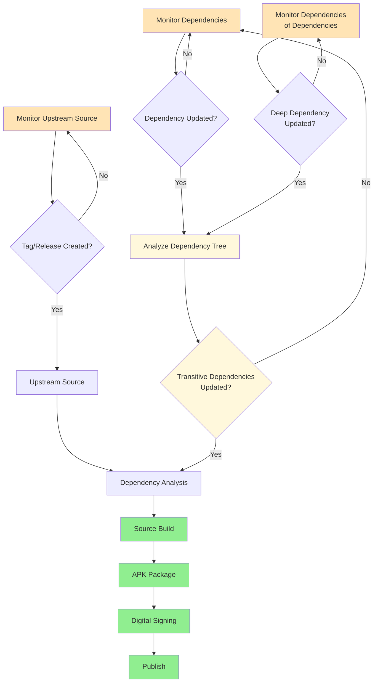

import { PackageCount, InlinePackageCount } from '../components/PackageCount'
import { PackageSearch } from '../components/PackageSearch'

# Package Library: Build Custom Images from Secure APK Packages

SecureBuild's Package Library provides access to thousands of secure APK packages rebuilt from source. Unlike pre-built container images, our package library lets you compose exactly the components you need while maintaining zero-CVE security guarantees.

## What's in the Package Library

Our package library contains <InlinePackageCount /> APK packages rebuilt from source &amp; available for X86_64 and AARCH64 architectures, including:

### **System Foundations**
- **Base System**: glibc, musl, busybox, ca-certificates
- **Core Utilities**: bash, coreutils, findutils, grep, sed, awk
- **System Libraries**: openssl, zlib, pcre, curl, wget

### **Development Tools**
- **Compilers**: gcc, clang, rust, go
- **Build Systems**: make, cmake, autotools
- **Package Managers**: npm, pip

### **Application Runtimes**
- **Languages**: python, node, java
- **Web Servers**: nginx
- **Databases**: postgresql, redis

### **Security & Monitoring**
- **TLS/SSL**: openssl, gnutls, mbedtls

Each package undergoes our comprehensive build process:

## Interactive Package Search

Search our comprehensive package library to find the components you need:

<PackageSearch />

